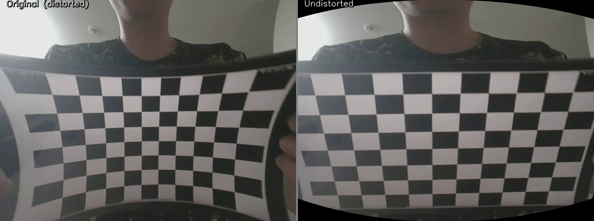

# iPhone 광각 카메라 보정 및 렌즈 왜곡 교정

OpenCV를 활용한 스마트폰 광각 렌즈의 카메라 보정 및 렌즈 왜곡 교정 파이프라인입니다.  
내부 파라미터(fx, fy, cx, cy)와 왜곡 계수(k1, k2, p1, p2, k3)를 추출하여 왜곡이 교정된 영상을 출력합니다.

---

## 파일 구성

| 파일 | 설명 |
|------|------|
| `gui.py` | **그래픽 UI** — 통합 앱 (권장) |
| `generate_chessboard.py` | A4 출력용 체스보드 캘리브레이션 타겟 생성 |
| `camera_calibration.py` | 영상에서 체스보드 코너를 검출하고 카메라 내부 파라미터 계산 |
| `distortion_correction.py` | 보정 결과를 영상 또는 이미지에 적용하여 왜곡 교정 |

---

## 요구 사항

```
Python >= 3.10
opencv-python >= 4.8
numpy >= 1.24
customtkinter >= 5.0
Pillow >= 9.0
```

설치:

```bash
pip install opencv-python numpy customtkinter Pillow
```

---

## 사용법 — GUI (권장)

```bash
python gui.py
```

앱을 실행하면 세 개의 탭이 열립니다.

### 탭 1 — 체스보드 생성기


사각형 수, 사각형 크기(mm), DPI를 설정한 후 **생성 및 미리보기**를 클릭합니다.  
체스보드 이미지가 PNG로 저장되며 앱 내에서 미리볼 수 있습니다.  
**100% 크기**로 인쇄하여 평평한 딱딱한 표면에 부착하십시오.

### 탭 2 — 카메라 보정


1. **파일 선택…** 클릭하여 체스보드 영상 파일 선택
2. 내부 코너 수(열 × 행), 사각형 크기(mm), 프레임 간격 설정
3. **보정 실행** 클릭
4. 완료되면 결과 테이블에 fx, fy, cx, cy, k1~k3, RMSE 표시
5. 보정 데이터는 `results/calibration.npz`에 저장됨

> **팁:** 긴 4K 영상을 빠르게 처리하려면 **프레임 간격**을 높게 설정하십시오 (예: 15~30).

### 탭 3 — 왜곡 교정


1. **영상** 또는 **이미지** 모드 선택
2. **파일 선택…** 클릭하여 입력 파일 선택
3. **Alpha 슬라이더** 조정 (0 = 검은 테두리 제거, 1 = 전체 픽셀 유지)
4. **교정 실행** 클릭
5. 앱 내에서 보정 전/후 비교 미리보기 표시
6. 교정된 영상과 비교 이미지가 `results/` 폴더에 저장됨

---

## 사용법 — 명령줄

### 1단계 — 캘리브레이션 타겟 출력

```bash
python generate_chessboard.py --cols 10 --rows 7 --square_mm 25 --out chessboard.png
```

`chessboard.png`를 **100% 크기**로 인쇄하고 (페이지 맞춤 없이) 평평한 딱딱한 표면에 부착합니다.  
실제 인쇄된 사각형의 크기를 자로 측정하고 값(mm)을 기록해 두십시오.

### 2단계 — 캘리브레이션 영상 촬영

카메라로 체스보드를 촬영합니다:
- 다양한 각도, 거리, 기울기로 촬영
- 모든 프레임에서 보드 전체가 보이도록 유지
- 30개 이상의 서로 다른 시점 확보 권장
- 영상 파일을 `data/` 폴더에 저장

### 3단계 — 카메라 보정 실행

```bash
python camera_calibration.py \
    --video data/chessboard.mp4 \
    --cols 9 --rows 6 \
    --square_mm 25 \
    --step 5 \
    --min_frames 20 \
    --save_frames \
    --output results/calibration.npz
```

| 옵션 | 설명 |
|------|------|
| `--video` | 입력 영상 경로 |
| `--cols` | 가로 방향 내부 코너 수 (사각형 수 - 1) |
| `--rows` | 세로 방향 내부 코너 수 (사각형 수 - 1) |
| `--square_mm` | 실측 사각형 크기 (mm) |
| `--step` | N번째 프레임마다 샘플링 (낮을수록 느리지만 더 많은 프레임) |
| `--min_frames` | 최소 허용 검출 프레임 수 |
| `--save_frames` | 코너 검출 프레임을 `results/calibration_frames/`에 저장 |
| `--no_display` | 헤드리스 실행 (GUI 창 없음) |

### 4단계 — 렌즈 왜곡 교정 적용

```bash
python distortion_correction.py \
    --video data/chessboard.mp4 \
    --calib results/calibration.npz \
    --alpha 0 \
    --out_video results/undistorted.mp4 \
    --out_compare results/comparison.jpg
```

| 옵션 | 설명 |
|------|------|
| `--alpha 0` | 검은 테두리 제거 (기본값, 유효 픽셀만 표시) |
| `--alpha 1` | 전체 픽셀 유지 (가장자리에 검은 테두리 발생 가능) |
| `--image` | 영상 대신 단일 이미지 사용 |

---

## 보정 결과

> 카메라: **iPhone 15 Pro — 광각 렌즈**  
> 해상도: `1920 x 1080` px | 사용된 프레임 수: `7`

### 내부 파라미터

| 파라미터 | 값 |
|----------|----|
| fx | 894.0735 px |
| fy | 893.9562 px |
| cx | 963.8285 px |
| cy | 556.4996 px |

### 왜곡 계수

| k1 | k2 | p1 | p2 | k3 |
|----|----|----|----|----|
| -0.003635 | 0.040183 | -0.001558 | -0.000154 | -0.150910 |

### 재투영 오차

| RMSE |
|------|
| 0.2716 px |

---

## 렌즈 왜곡 교정 데모




*좌: 원본 (왜곡됨) | 우: 왜곡 교정됨*


---

## 참고 사항

- iPhone 15 Pro 광각 렌즈는 강한 배럴 왜곡을 발생시켜 카메라 보정 실습에 적합한 대상입니다.
- RMSE < 1.0 px는 일반적으로 허용 가능한 수준이며, < 0.5 px면 우수한 품질입니다.
- 실제 사용할 해상도와 동일한 해상도로 보정을 수행하십시오.
- `results/calibration.npz` 파일에 전체 카메라 행렬과 왜곡 계수가 저장되어 재사용할 수 있습니다.
